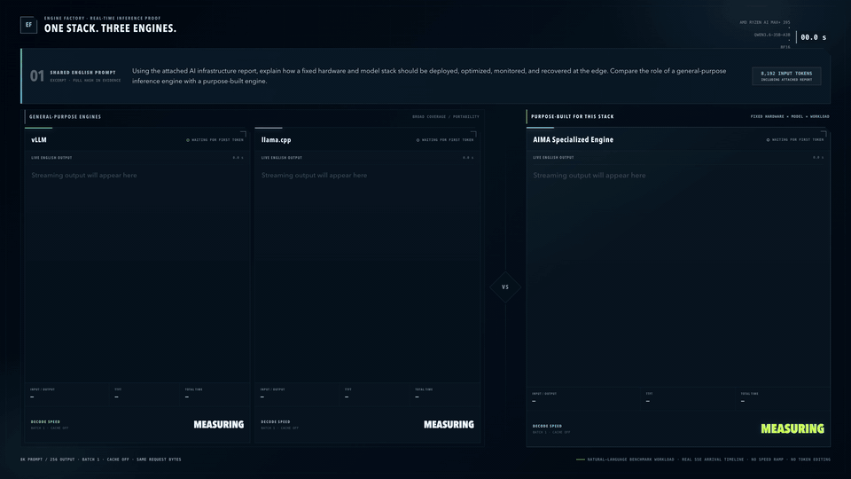

# AIMA AMD395 Qwen3.6 35B Linux Engine

[](LICENSE)
[](https://github.com/skyguan92/AIMA-AMD395-Qwen36-35B-Linux-Engine/actions/workflows/ci.yml)
[](https://github.com/skyguan92/AIMA-AMD395-Qwen36-35B-Linux-Engine/releases/tag/v1.5.1-native-vl.5)
[](docs/INSTALL.md)

A batch-1 BF16 inference engine specialized for
`Qwen3.6-35B-A3B` on AMD Ryzen AI Max+ 395 / Radeon 8060S Linux.

## Live Three-Engine Comparison

The same Qwen3.6-35B-A3B BF16 request is replayed side by side through vLLM,
llama.cpp, and the AIMA specialized engine on one AMD Ryzen AI Max+ 395. All
three runs use the same prompt bytes, batch size 1, temperature 0,
cross-request cache disabled, and real SSE arrival timing.

[](assets/demos/amd395-three-engine-comparison.mp4)

[Watch the full-resolution MP4](assets/demos/amd395-three-engine-comparison.mp4).
This recording is a visual comparison; the versioned performance and
qualification evidence below remain authoritative.

Version 1.5.1-native-vl.5 includes the complete fixed-model image, video, mixed-media
and multimodal conversation surface to the relocatable native package. One
resident process performs media processing, the 27-block vision tower and the
language model while retaining live SSE streaming and OpenAI function tools.
No Python, PyTorch, vLLM,
Triton, Transformers, or host ROCm userspace is loaded at runtime. The package
contains a static launcher, the native engine, pinned ROCm/AOTriton/CK
userspace, its own glibc loader, licenses and qualification metadata. Model
weights are not redistributed.

> **Release boundary:** v1.4.0 added `doctor`, `--build-info`, bearer
> authentication, socket timeouts and the hardened systemd template. v1.4.1
> admits variable-length cold prompts and ordinary multi-turn cache misses.
> v1.5.0 adds resident q1024/q2048/q4096/q8192 prefill dispatch and a
> capacity-bounded multi-entry prefix LRU. v1.5.1 replaces its serial
> unmatched-prompt tail with composed resident AOT prefill and repairs padded
> recurrent state at the logical prompt boundary. v1.5.1-native-vl.4 loads and
> warms the complete visual stack before readiness and preserves that exact
> text product under strict paired no-regression gates. v1.5.1-native-vl.5 adds
> opt-in thinking, bounded tool-call progress and a serial chat executor that
> keeps HTTP health and shutdown control traffic responsive during inference.

中文说明见 [README.zh-CN.md](README.zh-CN.md).

## Author and repository structure

This project was created and is maintained by
[Jiawei Guan / 关嘉伟 (@skyguan92)](https://github.com/skyguan92).

- **Original upstream:** [skyguan92/AIMA-AMD395-Qwen36-35B-Linux-Engine](https://github.com/skyguan92/AIMA-AMD395-Qwen36-35B-Linux-Engine)
- **Organization fork and primary public showcase:** [Approaching-AI/AIMA-AMD395-Qwen36-35B-Linux-Engine](https://github.com/Approaching-AI/AIMA-AMD395-Qwen36-35B-Linux-Engine)

The package metadata and citation file use the same GitHub-linked author
identity. The existing copyright notices remain unchanged.
Release assets and CI are published from the original upstream; the
organization fork is the stable public showcase and issue-tracking surface.
Product changes are kept aligned across both repositories, while
organization-only identity metadata may differ.

## Read this boundary first

The portable native runtime is qualified for the complete published batch-1
text envelope:

| Input tokens | Output tokens | Status |
|---:|---:|---|
| 1,024 | 512 / 1,024 | qualified |
| 2,048 | 512 / 1,024 | qualified |
| 4,096 | 512 / 1,024 | qualified |
| 8,192 | 512 / 1,024 | qualified |
| 16,384 | 512 / 1,024 | qualified |
| 32,768 | 512 / 1,024 | qualified |
| 65,536 | 512 / 1,024 | qualified |
| 131,072 | 512 / 1,024 | qualified |
| 262,143 | 1 | qualified window endpoint |
| 261,632 | 512 | qualified window endpoint |
| 261,120 | 1,024 | qualified window endpoint |

HTTP prompts may have any positive token length that fits the configured cache
capacity together with the requested output. The selected context remains the
fast AOT prefill endpoint. A q8192 process keeps q1024/q2048/q4096/q8192
buckets resident and composes the smallest bucket total covering each real
prompt; only the final segment is padded when exact composition is impossible.
No prompt token falls through to serial decode. Prefix hits are an optimization,
never an admission requirement. Input plus generated tokens may not exceed
262,144. The native runtime now replaces the published v1.1 performance
envelope; the Python implementation remains only as a compatibility and
provenance reference. See
[native/product-contract-v1.5.1-native-vl.5.json](native/product-contract-v1.5.1-native-vl.5.json).

The same process accepts single/multiple images, single/multiple videos,
image-video mixtures, ordered text/media interleaving, multi-turn media reuse
and replacement, tools, streaming and non-streaming requests. The frozen
capability envelope covers formats, aspect ratios, transparency, dynamic image
resolution, video containers/fps/frame sampling and explicit error limits.
Greedy decoding retains its certified top-1 path; positive `temperature` adds
seeded full-vocabulary BF16/top-p sampling for text and VL, with stream and
non-stream parity. Audio, batching and concurrent execution remain outside
this release boundary.

## Runtime contract

The deployment host needs:

- Linux x86-64 with an AMDGPU/KFD kernel driver and render nodes;
- Radeon 8060S / `gfx1151`;
- 128 GB installed memory with the documented 96 GiB GTT pool;
- the separately obtained, hash-matching 26-shard BF16 model checkpoint.

It does not need a system ROCm installation or a Python environment. The exact
archive size and recursive file inventory are recorded in the release manifest
and checksum sidecar. Cross-version
compatibility comes from the bundled loader and libraries; kernel/GPU
compatibility cannot be bundled away.

Configure memory before loading the model:
[English](docs/MEMORY.md) · [中文](docs/MEMORY.zh-CN.md).

## Quick start

Download the archive and checksum from the
[upstream v1.5.1-native-vl.5 release](https://github.com/skyguan92/AIMA-AMD395-Qwen36-35B-Linux-Engine/releases/tag/v1.5.1-native-vl.5),
then extract it anywhere:

The qualified archive is
`aima-engine-native-portable-194f2a673904.tar.zst`, SHA-256
`59f30c4232b8459f3efcd7b8506cc71b957614c0aac1fa96a2eb4e15f52940a3`.

```bash
sha256sum -c aima-engine-native-portable-*.tar.zst.sha256
tar --zstd -xf aima-engine-native-portable-*.tar.zst
cd aima-engine-native-portable-*

./bin/aima-engine --version
./bin/aima-engine serve \
  --model-dir /srv/models/Qwen3.6-35B-A3B \
  --context-tokens 8192 \
  --allowed-local-media-path /srv/aima-media \
  --host 127.0.0.1 \
  --port 8000
```

The service loads the model once, verifies all 1,026 tensors and
70,214,363,872 payload bytes, warms both vision-attention variants and keeps
weights, plans, KV/recurrent state and cache resident. Readiness is reported as
one JSON line only after both language and vision paths can serve requests.

In another shell:

```bash
curl -fsS http://127.0.0.1:8000/health
curl -fsS http://127.0.0.1:8000/v1/models
```

A deterministic chat request uses the OpenAI-compatible subset:

```bash
curl -fsS http://127.0.0.1:8000/v1/chat/completions \
  -H 'Content-Type: application/json' \
  -d '{
    "model": "aima-amd395-qwen36-35b",
    "messages": [{"role": "user", "content": "Hello"}],
    "temperature": 0,
    "top_p": 1,
    "max_tokens": 512
  }'
```

For stochastic generation, set `temperature` in `(0,2]`, `top_p` in `(0,1]`
and optionally a non-negative `seed`. The effective seed and sampling work are
reported under `aima_amd395.sampling`; an explicit seed reproduces the same
token sequence across stream and non-stream requests.

Qwen reasoning is opt-in and backward compatible:

```json
"thinking": {"type": "enabled", "budget_tokens": 4608}
```

The non-stream response separates `message.reasoning_content` from final
`message.content`; SSE emits `delta.reasoning_content` before `delta.content`.
`budget_tokens` is a validated declaration inside the combined `max_tokens`
limit, not an additional hard stop. Use `type:"disabled"` for an explicit
answer-only text or VL request. See [docs/API.md](docs/API.md) for the exact
default, validation, and raw-token rules.

Live token output uses real SSE decode streaming:

```bash
curl -N http://127.0.0.1:8000/v1/chat/completions \
  -H 'Content-Type: application/json' \
  -d '{
    "model": "aima-amd395-qwen36-35b",
    "messages": [{"role": "user", "content": "Hello"}],
    "temperature": 0,
    "top_p": 1,
    "max_tokens": 512,
    "stream": true,
    "stream_options": {"include_usage": true}
  }'
```

The same endpoint accepts OpenAI function `tools`, `tool_choice`,
`parallel_tool_calls`, assistant tool-call history and tool responses. See
[docs/API.md](docs/API.md) for request/response examples and variable-prompt
execution details. Exact normalized duplicates in one assistant response are
suppressed. After two empty/error results for the same historical signature,
another identical call is suppressed and `aima_amd395.tool_progress` tells the
caller to change strategy or return a blocked/best-effort result.

An image request uses the same endpoint and ordered OpenAI content parts:

```bash
curl -fsS http://127.0.0.1:8000/v1/chat/completions \
  -H 'Content-Type: application/json' \
  -d '{
    "model":"aima-amd395-qwen36-35b",
    "messages":[{"role":"user","content":[
      {"type":"text","text":"Describe this image."},
      {"type":"image_url","image_url":{"url":"file:///srv/aima-media/example.jpg"}}
    ]}],
    "temperature":0,
    "max_tokens":128
  }'
```

Use `video_url` for videos and repeat or interleave image, video and text parts
as needed. Local files require an explicit allowlisted root; remote media
requires exact domain allowlists. Bounded data URIs are also supported.

Stop it with `Ctrl-C` / `SIGTERM`, or:

```bash
curl -fsS -X POST http://127.0.0.1:8000/shutdown
```

For a managed resident service, install the templates under `share/systemd/`;
then `systemctl start|status|stop aima-engine` provides the lifecycle.

## Native CLI

The published v1.5.1-native-vl.5 CLI provides:

```text
aima-engine --build-info
aima-engine doctor [--model-dir PATH] [--device INDEX] [--json]
aima-engine --version
aima-engine serve --model-dir PATH --context-tokens N
aima-engine resident-session-probe --model-dir PATH [qualification options]
aima-engine tokenizer-probe --model-dir PATH --text TEXT
aima-engine chat-template-probe --model-dir PATH --user TEXT
aima-engine chat-template-probe --model-dir PATH --request-json JSON
```

`serve` runs in the foreground by design and is suitable for systemd,
containers and direct supervision. Internal qualification probes are shipped so
published correctness and performance claims are reproducible without a
framework runtime.

The optional source-install control CLI can also act as a client:

```bash
export AIMA_API_KEY_FILE=/path/to/client-readable-api-key
aima-engine models
aima-engine chat --stream "PROMPT"
aima-engine chat --stream --tools-json tools.json --tool-choice auto "PROMPT"
aima-engine chat --messages-json conversation.json --tools-json tools.json
```

The pure-Python wheel is deliberately client-only and has no runtime
dependencies: it exposes `status`, `models`, `chat` and `shutdown`. Legacy
Python server/image-management commands appear only in a full source checkout;
deployment uses the separately qualified native archive. `--api-key-file` (or
`AIMA_API_KEY_FILE`) supplies bearer authentication without placing the token
in process arguments.

## Qualified native results

The table below is the frozen v1.5.1 text baseline. The native VL candidate is
promoted only when every cell reaches it using six alternating adjacent pairs;
the historical 97% safety floor cannot excuse a paired regression.

| Input | output512 prefill | output512 decode | output1024 prefill | output1024 decode |
|---:|---:|---:|---:|---:|
| 1,024 | 1630 | 34.00 | 1630 | 34.02 |
| 2,048 | 1693 | 33.85 | 1693 | 33.85 |
| 4,096 | 1569 | 33.32 | 1569 | 33.30 |
| 8,192 | 1660 | 32.30 | 1660 | 32.28 |
| 16,384 | 1440 | 30.79 | 1440 | 30.78 |
| 32,768 | 1358 | 28.22 | 1358 | 28.22 |
| 65,536 | 1170 | 24.65 | 1170 | 24.65 |
| 131,072 | 869.7 | 19.62 | 869.7 | 19.62 |

Window endpoints reached `555.2` prefill tok/s at 262143/output1,
`555.1 / 14.04` prefill/decode tok/s at 261632/output512, and
`559.3 / 14.02` at 261120/output1024. All 19 cells retained at least 97% of
their frozen baseline; the minimum prefill/decode retentions were `1.010x`
and `0.9855x`.

Other gates:

- full-vocabulary KLD passed at nine contexts through q261632; the maximum was
  `0.002174`, with matching top-1 everywhere and the gate fixed at `0.005`;
- exact 128-token completion identity passed on the frozen q8192 fixture;
- the frozen answer-only MMLU-256 regression scored `218/256` (`85.16%`),
  two above the GB10 vLLM reference; all 256 prompt-token hashes matched and
  252 completion-token hashes were byte-identical;
- q8192 command-to-ready median: `44.90 s` versus the `51.41 s` ceiling;
- q32768 exact-prefix TTFT: `2637x` speedup with `1.0003` decode retention;
- resident HTTP: one model load across cold and cached requests, with clean
  shutdown;
- live chunked SSE matched the non-stream token/text hashes, and structured
  tool calls matched across stream/non-stream paths; disconnect cancellation
  preserved server health.
- a 16-token cold prompt, its exact replay, a 36-token ordinary next-user turn
  and an unrelated short request after long-context work all passed; the two
  independent conversations were isolated and returned HTTP 200;
- q1024/q2048/q4096/q8192 raw-token requests selected their matching resident
  AOT buckets, and an A/B/A request sequence proved four-entry LRU reuse.

The auditable source of truth is the
[patch product contract](native/product-contract-v1.5.1-native-vl.5.json) and
the hash-bound release evidence mirrored after publication. Its package-input
qualification is embedded as `share/aima/qualification.json`. The `.5`
archive is isolated and soaked for one hour on AMD395, then rolled back to the
exact v1.5.1 archive. The `.4` two-host portability result is inherited only
for the unchanged portable userspace/provider closure through the contract's
fail-closed runtime-diff rule; it is not described as an exact `.5` host run.
The frozen baseline and optional striped-startup evidence remain documented in
[docs/PERFORMANCE.md](docs/PERFORMANCE.md).

Run `make verify-evidence` to verify the mirrored `.5` summaries and every
referenced raw tree. The `.4` baseline remains separately verifiable with
`python3 scripts/verify-release-evidence.py --release 1.5.1-native-vl.4`.

## Build the archive

Runtime deployment has no framework dependency; building from source does.
The qualified builder needs ROCm/HIP, Python for generators, AMD Composable
Kernel at commit `6667a9021713f794a2c9aee4696c19f6cf376235`, and the pinned
AOTriton 0.11.1 development distribution:

```bash
export CK_DIR=/path/to/composable-kernel
export AOTRITON_ROOT=/path/to/distribution/root/containing/include-and-lib
export QUALIFICATION_RECORD=/path/to/qualified-product-result.json
export AIMA_RELEASE_VERSION=X.Y.Z
export AIMA_RELEASE_TAG=vX.Y.Z

make check
make build-native build-native-runtime
# Run the documented qualification against these exact artifacts.
make package-native
```

The packager rejects absolute RUNPATHs and unresolved ELF dependencies,
requires every executable/provider hash to match the complete qualification,
includes all upstream notices, generates a recursive SHA-256 manifest, and
emits one deterministic `.tar.zst` archive under `dist/`. Packaging does not
rebuild the qualified artifacts.

Detailed instructions: [docs/INSTALL.md](docs/INSTALL.md).

## Repository map

```text
native/                      native engine, AOT closure and product contract
benchmarks/shape-lab/native/ CK-Tile sources and compatibility artifacts
benchmarks/results/          release qualification records
scripts/                     deterministic build, closure and package tools
packaging/systemd/           service lifecycle templates
docs/                        install, API, memory, architecture and evidence
aima_engine/                 retained v1.1 compatibility control plane
```

## Compatibility runtime

The Python control plane and the frozen v1.1 model-math engine remain in the
source tree for the wider context matrix and historical reproducibility. They
are not loaded by the portable native archive. Do not mix the two performance
or dependency claims.

## Security

The HTTP server binds to `127.0.0.1` by default. It supports a bearer token from
`--api-key-file`, refuses an unauthenticated non-loopback bind by default,
bounds socket operations and can remove `POST /shutdown`. Local media uses
descriptor-relative no-symlink access under explicit roots; remote media uses
per-hop domain/address checks with redirect, downgrade, byte and deadline
limits. TLS, rate limiting and multi-user authorization still belong in a
gateway. See
[SECURITY.md](SECURITY.md).

## License

AIMA project code is licensed under
[Apache License 2.0](LICENSE). Bundled and generated third-party components
retain their upstream terms; see [NOTICE](NOTICE),
[THIRD_PARTY_NOTICES.md](THIRD_PARTY_NOTICES.md), and the archive's
`licenses/` directory. Model weights are not included.
